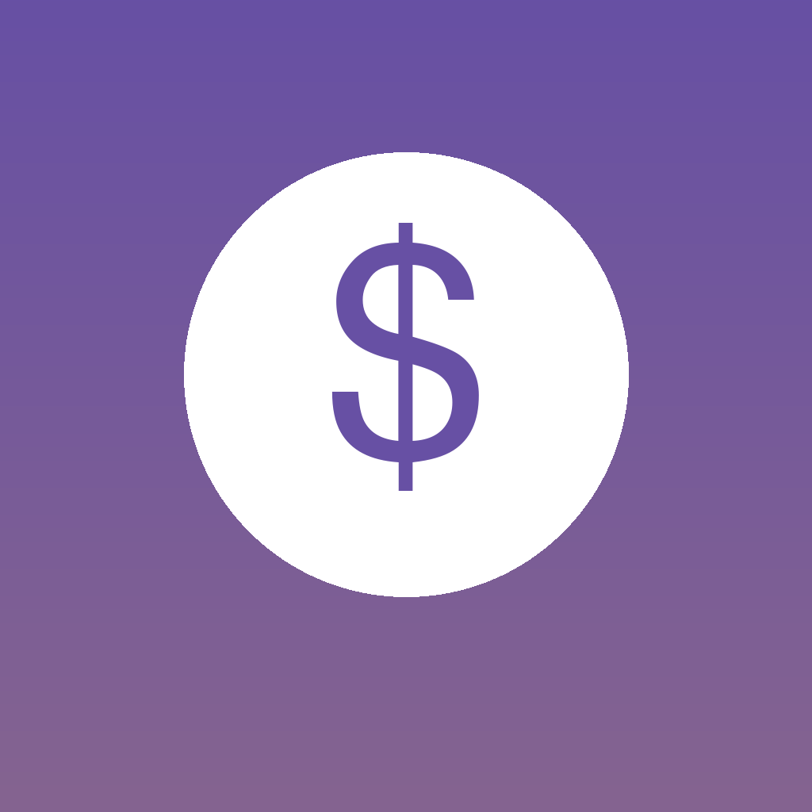
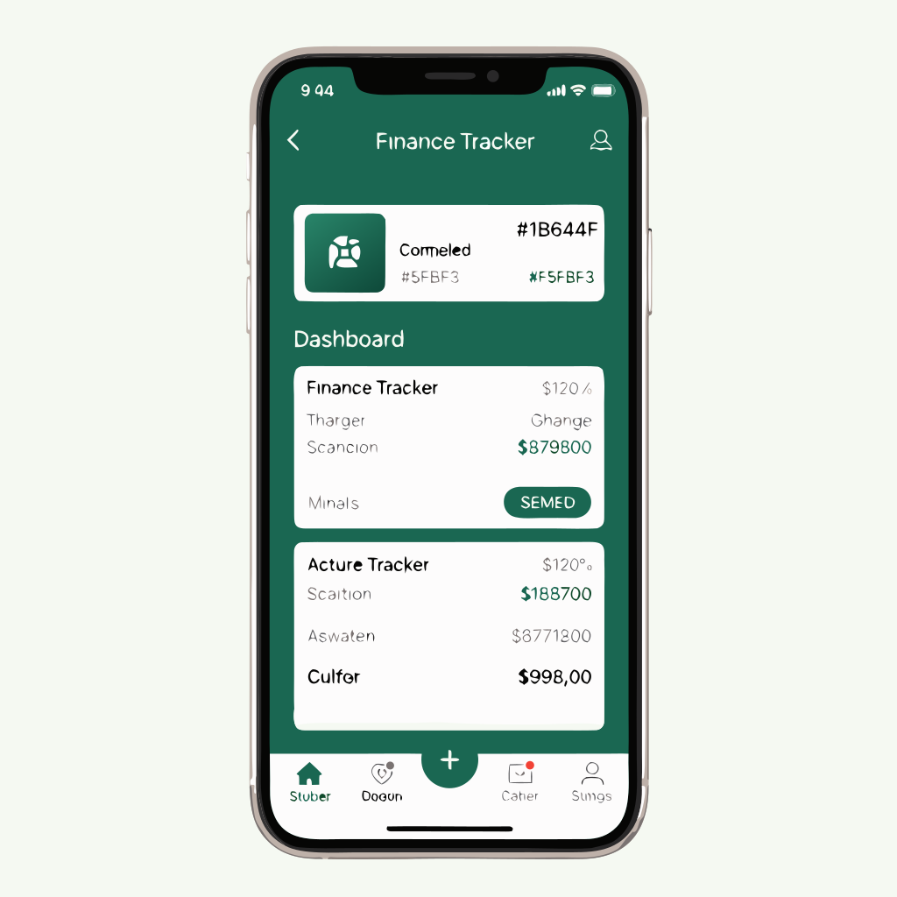
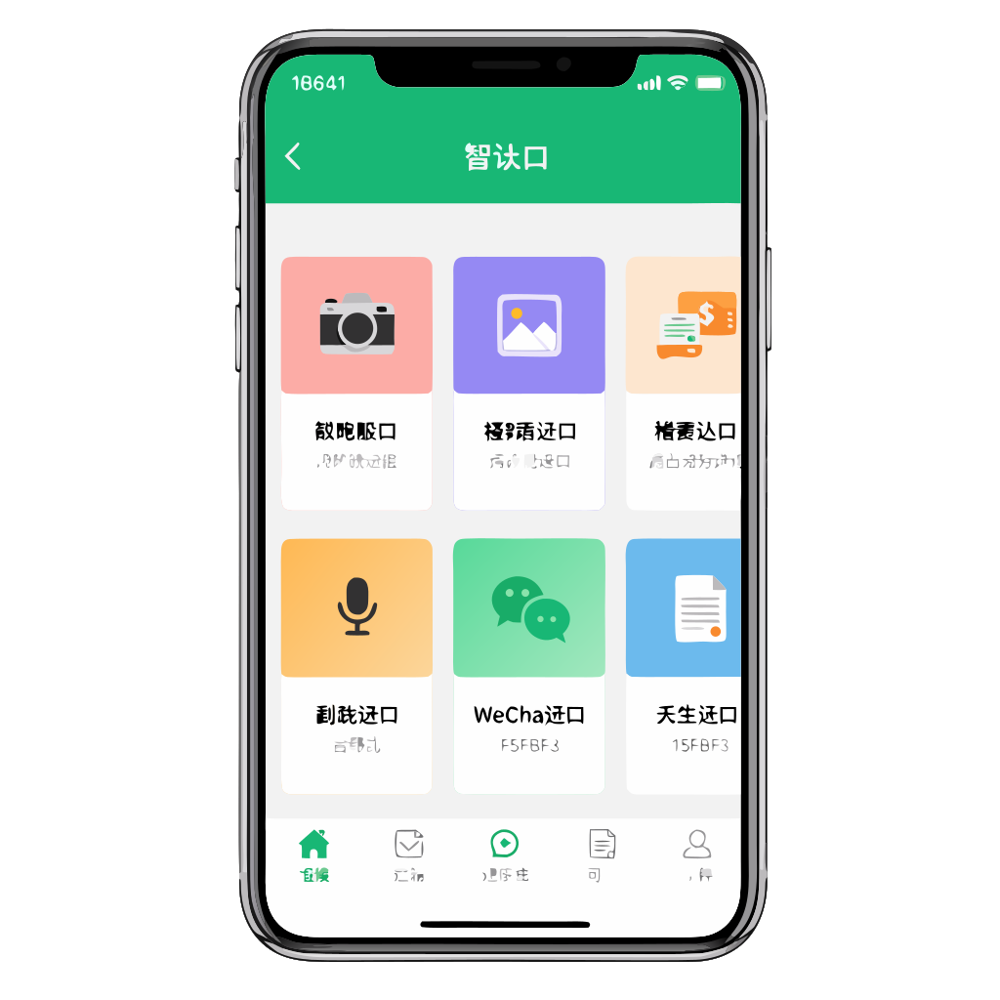

<p align="center">
  
</p>

<h1 align="center">Finance Tracker</h1>

<p align="center">
  <a href="README.zh-CN.md">中文</a> | English
</p>

<p align="center">
  A beautifully crafted iOS expense tracking app built with <strong>SwiftUI + SwiftData</strong>,<br/>
  featuring <strong>Material 3 Expressive</strong> design and smart import capabilities.
</p>

<p align="center">
  
  
  
  
  
</p>

---

## Screenshots

<p align="center">
  
  &nbsp;&nbsp;
  
  &nbsp;&nbsp;
  
  &nbsp;&nbsp;
  
</p>

<p align="center">
  <em>Home Dashboard &nbsp;|&nbsp; Expense Input &nbsp;|&nbsp; Data Analysis &nbsp;|&nbsp; Smart Import</em>
</p>

---

## Features

### Core
- **Digital Keypad Entry** — Quick numeric input for expenses and income
- **Two-level Categories** — 14+ expense and 7+ income categories, fully customizable
- **Fixed Expense Manager** — Enter annual amounts, auto-calculates monthly/quarterly (mortgage, insurance, tuition, etc.)
- **Multi-account Support** — Cash, bank cards, Alipay, WeChat, with inter-account transfers

### Smart Import
- **Receipt Scanner** — Camera-based OCR using Vision Framework
- **Screenshot Import** — Extract transaction data from bill screenshots
- **Voice Input** — Speak your expenses, auto-parsed via Speech Framework
- **WeChat Import** — Paste WeChat conversations/bills for auto-extraction
- **File Import** — Supports CSV, PDF, JPG, PNG formats

### Data Analysis
- **Multi-period Reports** — Monthly, quarterly, and yearly breakdowns
- **Charts & Visualization** — Pie charts (category composition) and bar charts (spending trends) via Swift Charts
- **Category Rankings** — Per-category spending share and details
- **Data Export** — CSV and JSON export

### User Experience
- **Local Auth** — Registration and login with SwiftData persistence
- **Personalized Avatars** — Choose your profile icon
- **Dark / Light Mode** — Full theme support
- **Bilingual** — Chinese (Simplified) and English localization

---

## Tech Stack

| Layer | Technology |
|---|---|
| **UI Framework** | SwiftUI (iOS 17+) |
| **Data Persistence** | SwiftData |
| **Charts** | Swift Charts |
| **OCR** | Vision Framework |
| **Speech Recognition** | Speech Framework |
| **Design System** | Material 3 Expressive |
| **Design Sync** | Figma Code Connect |

---

## Project Structure

```
FinanceTracker/
├── App/                        # App entry point
├── DesignSystem/
│   ├── Tokens/                 # M3 color, typography, spacing tokens
│   ├── Components/             # 30 reusable UI components
│   └── Theme/                  # Theme configuration
├── Models/                     # SwiftData models (User, Expense, Account, Budget...)
├── Views/
│   ├── Auth/                   # Login & registration
│   ├── Home/                   # Dashboard & calendar
│   ├── Input/                  # Expense entry with numeric keypad
│   ├── Import/                 # Camera, voice, file, WeChat import
│   ├── Analysis/               # Reports & charts
│   ├── Categories/             # Category management
│   ├── Accounts/               # Account management
│   └── Settings/               # App preferences
├── ViewModels/                 # MVVM view logic
├── Services/                   # OCR, voice recognition, data export
└── Utilities/                  # Extensions & localization
```

---

## Design System

Built on **Material 3 Expressive** with full Figma synchronization:

- **Color Tokens** — `md-sys-color-*` naming, Light/Dark dual-mode palette
- **Typography** — `md-sys-typescale-*` complete type scale
- **Spacing** — `md-sys-spacing-*` 8pt grid system
- **Shape** — `md-sys-shape-corner-*` corner radius system
- **Elevation** — `md-sys-elevation-level*` shadow hierarchy
- **30 Components** — Buttons, cards, chips, FABs, sheets, dialogs, charts, and more

Figma Token Studio compatible JSON export is built in:

```swift
let tokens = FigmaDesignTokens.generateFullTokensJSON()
```

---

## Getting Started

### Requirements
- Xcode 15.0+
- iOS 17.0+
- Swift 5.9+

### Build & Run

```bash
# Clone the repository
git clone https://github.com/Terr0rblade1009/Finance-Tracker.git

# Open in Xcode
open FinanceTracker.xcodeproj

# Select a simulator or device, then press Cmd + R
```

### Permissions
The app requests the following permissions (pre-configured in Info.plist):
- **Camera** — Receipt scanning
- **Microphone** — Voice input
- **Speech Recognition** — Voice-to-text parsing
- **Photo Library** — Image import

---

## License

[MIT License](LICENSE) — free to use, modify, and distribute.
